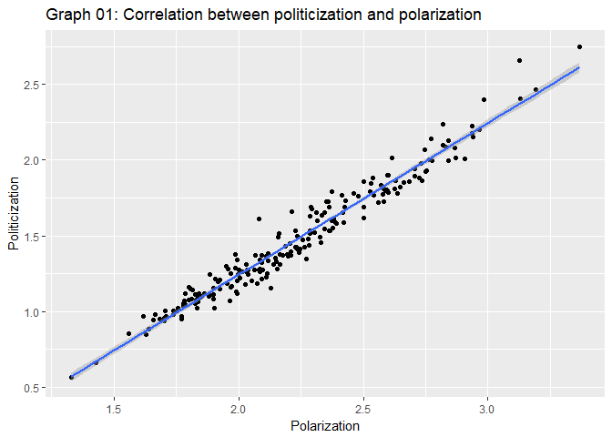
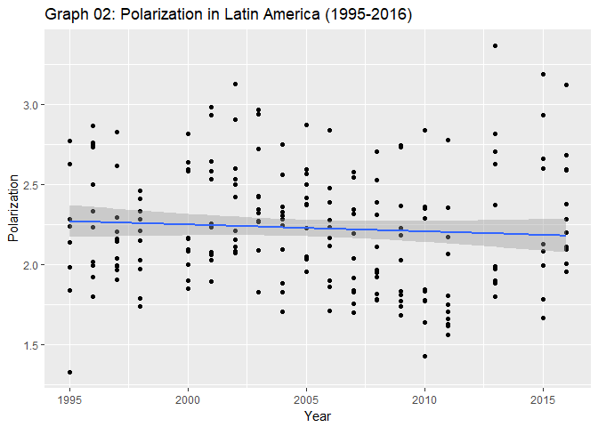
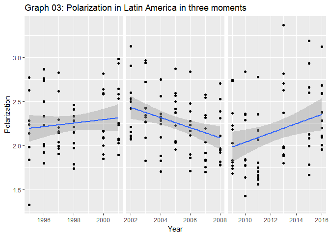
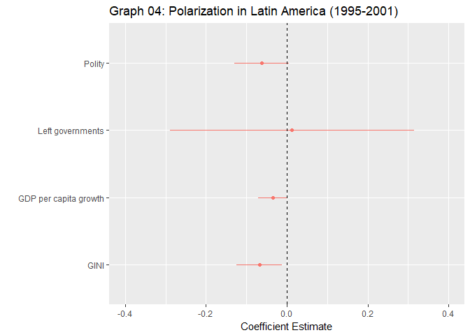
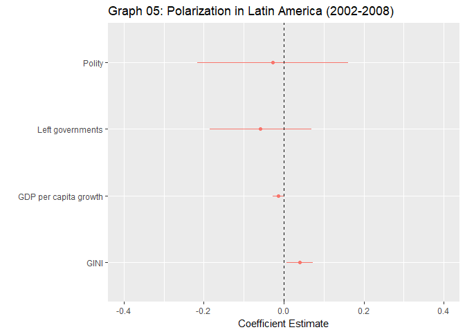
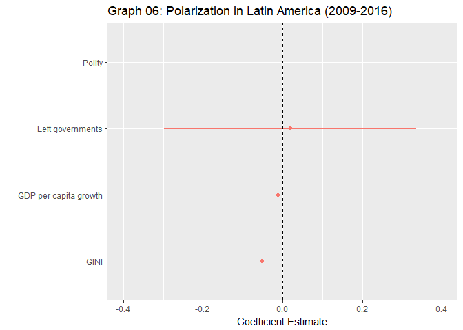
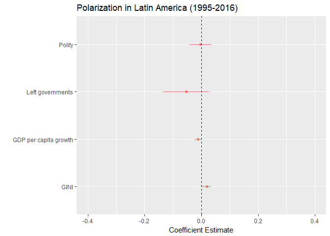

What are the causes of polarization of Latin America's politics?
================
Raduan van Velthem Meira
February 20, 2018

Introduction
============

The democratic third wave have generated a big political impact in Latin America. The region used to coups and military rule gave room to vibrant democracies with competitive elections and reasonable political and economic stability. It is natural to suppose that this new democratic reality generate a impact in the way the general population identify itself politically.

This initial research try to address this issue. We analyze the degree of politicization and polarization in eleven countries of the region: Argentina, Bolivia, Brazil, Chile, Colombia, Ecuador, Mexico, Paraguay, Peru, Uruguay and Venezuela..

We divided this blog post in three sections. The first is this small introduction. Second, is a brief a theoretical presentation and justification of the use of the data. Third, we will present a fixed effect analysis of the data to better comprehend the trends in the data.

The importance of Left and Right
================================

The definition of polarization and politicization is not so trivial as it may appears. Is it feasible to define ideologies in a multidimensional issue spaces where the set of preferences are so diverse? How can we cope such diversity in a unidimensional continuum of Left and Right?

First, the Left and Right concepts are old and well-known. They are commonly acknowledge as the expression of political preferences. Second, they are vague enough to be able to represent many ideas. Therefore, 'Left' and 'Right' are important as self-identification concepts; a way to manifest your political position, identity.

In this scenario, we can divide individuals in two groups. First, the politically indifferent (***R**I**L*). This is a person which manifesting any ideology does not generate a utility that justify the cost of taking a stand. The person do not see that taking a political identity as something relevant. Second, the politically eager (***R**R**L* or *L**R**R*). The cases where the individual understand that she receive some utility if she manifest some political identity either 'Left' or 'Right'.

We aim to to use data from the Latinobarometro to assert the degree of polarization in Latin America. To do so, we will use the variable of 'self identification of 'Left-Right'. We manipulate this data to indicate that goes from -5 to 5 where -5 is extreme left and 5 is extreme right. We do that with the assumption that the people which have not identify themselves with from -1 to -5 or from 1 to 5 are the non-ideological individuals [1]. From this data, we present the model as follow, Where *X**i* is the observations:

*Y*1 is the mean of the absolute value of the \`self-identification of Left-Right'. This means the level of politicization in a given country since is the distance, on average, that the country s from 0 (***R**I**L*). *Y*2 is the standard error which indicate the degree of ideological polarization in a given country. Both values goes from 0 to, approximately, 5.

Although 'politicization' and 'polarization' seems, at the first glance, synonymous; they are independent concepts. We can imagine a society made by three individuals illustrated in set A (A={-5,-5,-5}). Here the degree of politicization (*Y*1) is 5, but the degree of polarization is 0. The set B (B=${1, 0, −1}$), in turn, have a *Y*1 of only 0.667, but a *Y*2 of 1. It is possible to have a high politicization and a low and polarization and, vice-versa.

Empirically, it is reasonable to think of societies becoming more or less politicized without changing their degree of polarization. For example, the society as a whole assuming a Left's or Right's identity. In Latin America, one could say that similar situation might have happen recently with the \`Pink tide', a sequence of of left-wing presidents taking power. To put this assumption to a test, we plot the correlation between politicization and polarization:

As we can see, there is a strong correlation between the two. This, on one hand, generate evidences against the assumption of a Latin America's move to the Left. On the other hand, the strong correlation allow us to use polarization as a proxy for polarization (and vice-versa). Therefore, we you only use the variable polarization for the rest of this post. There are three different explanatory frameworks we present to understand polarization in Latin America.

First, socio-economic factors. We will use GDP per capita growth (annual %) and Gini. the former analyzes whether the variance of well-being affect polarization and the latter if more unequal or more equal societies are more prone to be polarized. Second,political factors. We will use the data from Polity an ordinal variable where 0 is to non-Left governments, 1 moderate left-wing governments and 2 is radical left-wing governments.The definition of what were the moderate and radical left-wing governments comes from Castañeda (2006)[2]. The first allows us to assert the impact of being more or less democratic to polarization; and the second to assert if the the recent left-wing governments in Latin America have generated more polarization.

The evolution of Latin America's political polarization
=======================================================

The first question that we must make is if have any trend the political polarization in Latin America:

The graph 02, in fact, is hiding a more complex pattern that goes along with the recent Latin America history. Dividing the period in three moments we see a pendulum behavior that goes along with period before the 'pink tide', the peak of the left-wing governments and the current political and economic crisis:

Hence, we will now present an data panel analysis with the variable for each of the periods to understand what factor better explain polarization in Latin America. First, 1995 to 2001:

This is a moment in Latin America before the peak of the 'Pink tide', mostly ruled by pro-market governments. This, in part, explain the high variance of the variable 'Left governments'. The only variable with significance is the Gini index, indicating that more unequal societies make them more polarized. Inequality is a very poignant topic in Latin America due to the fact, in the period, was the mos unequal region in the world(IMF[3]. It reasonable to assume that inequality is one key factor causing polarization in the region.

This is period is high tide of the 'pink tide'. Once again the left left governments variable not only is not significant, but also have a major variance. This highlight the diversity the way the left governments were interpreted by the population in very distinct ways, opposing the common idea of two lefts in the region. Similarly, the polity variance demonstrate the beginning of decay in the Latin American institutions. Once again, Gini index is the only variable with significant correlation in polarization. Once again it makes us affirm the social and political importance of inequality in Latin America.

finally, the recent years. This is a moment of burst of the left-wing governments. The current economic and political crisis have lead to the fall of 'pink tide' presidents. Then, makes sense to understand that the polarization is caused by economic factors. Also, we see how the political variable have a massive variance, indicating the political diversity in the region.

The three periods indicate the preponderance of economic factors - especially Gini - to understand the polarization variations in Latin America. To give more one more input, let's analyze the panel data for the entire period:

Only the GDP per capita and Gini are significant, indicating the economic preponderance to estimulate the polulation towards political action in comparison to ideational factors such as party ideology. In addition, this initial data of the topic goes along the arguments presented by Roberts (2015)[4]

[1] We consider in this group not only the ones who have answer 0 (5 in the original data, but all the other answers (e.g \`I don't know') not only because this type of answer suits well with the argument of ideological indifference, but, also, makes the result presented more robust)

[2] Castaneda, Jorge G. "Latin America's Left Turn." Foreign Affairs. 14 Mar. 2018. Web. 14 Mar. 2018.

[3] source: <http://www.imf.org/external/pubs/ft/fandd/2015/09/lustig.htm>

[4] Roberts, Kenneth M. 2015. Changing Course in Latin America Party Systems in the Neoliberal Era
